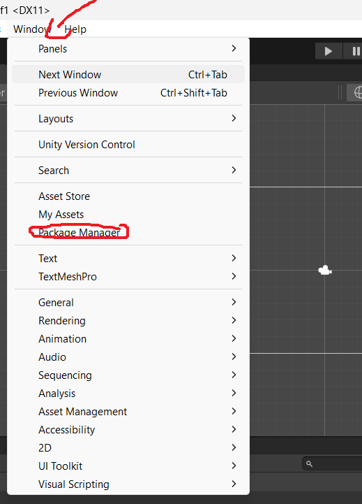
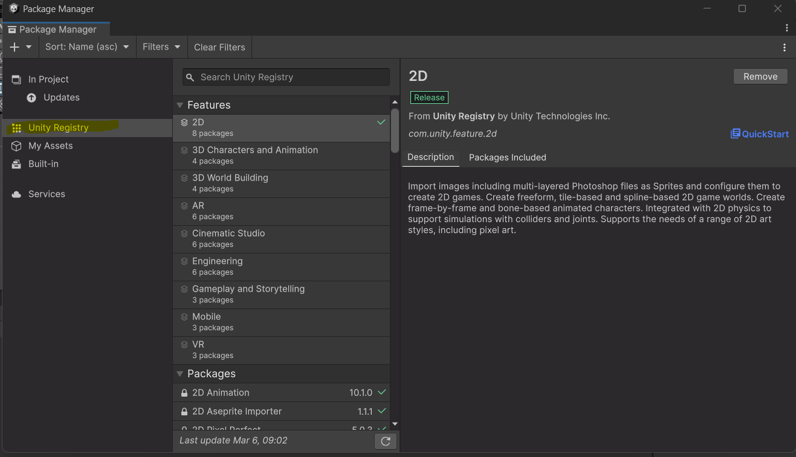
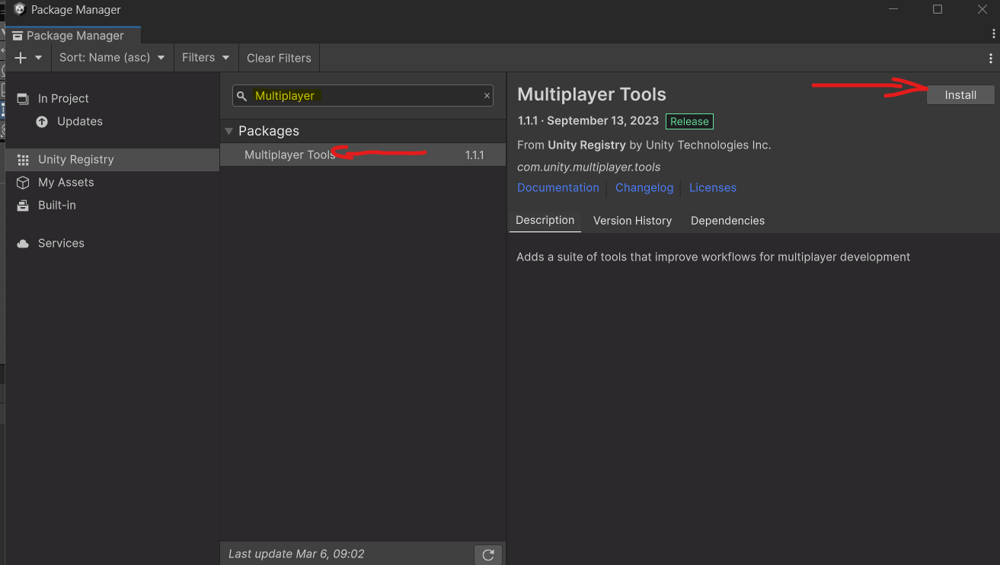
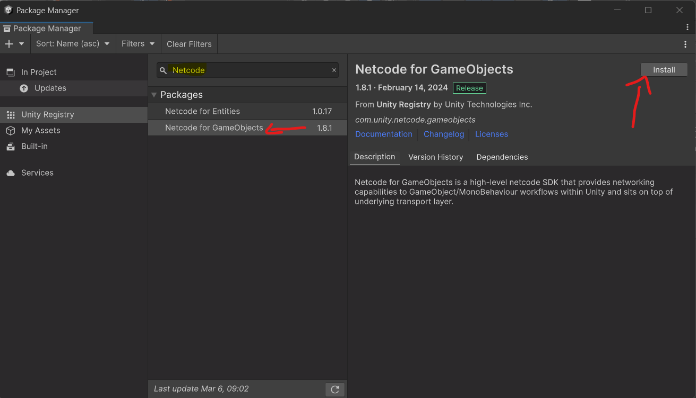

# Installation of Netcode for gameobjects
[Go back](Network.md)

First create a new project in unity. Make sure the version selected is 2020.2.4f1-dots-5 or later. Selected either 2D or 3D. I will recommend 2D, for this tutorial.

When the project is open, go to Window/Package Manager

Then open Unity Registry

Search for Multiplayer and install the *Mutliplayer Tools*

Now search for Netcode and install the *Netcode for GameObjects*

**Congratulations you finished Installation of Netcode for gameobjects**
[Next](gaupe.netcode.md)