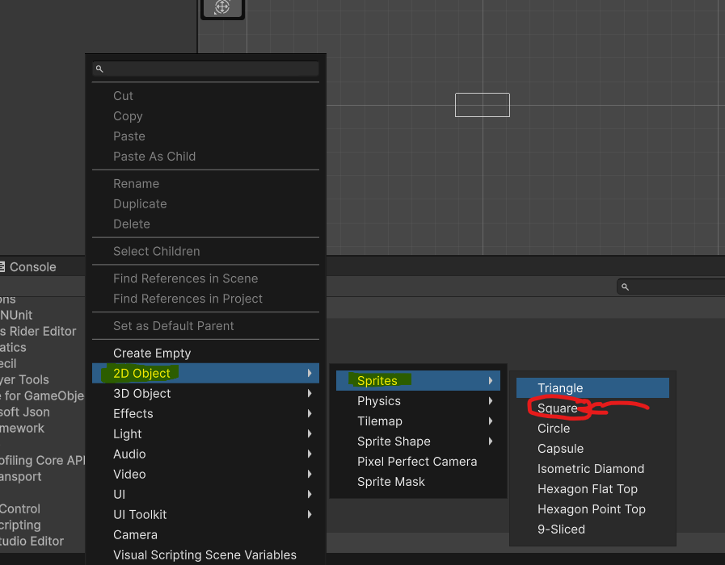
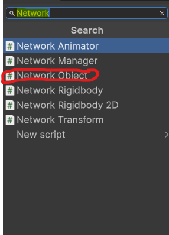
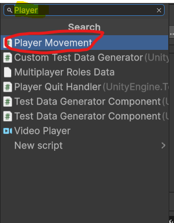

# Adding a player, and make it a client
[Go back](Network.md)

Create a new Script and call it "PlayerMovement". And the content of the script is [here!](data/playermovement.cs)

The code here is not relevante, the only thing that is relevante is it extends `ClientScript` from `Gaupe.Netcode`.

`Gaupe.Netcode.ClientScript` is a script that only runs on the client owner.
Example: the server makes a new player and assign the owner to the player. The `ClientScript` disable it self if you dont own it.

Right click in the Hierarchy, and go to 2D->Sprites->Square.!

Add the `Network Object` Compontent on the square.

Add the `Player Movement` Compontent on the square.

Drag the Square down in the `Project Window`. And delete the one in the Hierarchy.
Open the `Network Manager` and drag the Square to the `Player Prefab`

When you play, you should move around.

**Congratulations you finished Adding a player, and make it a client**
[Next](transform.md)