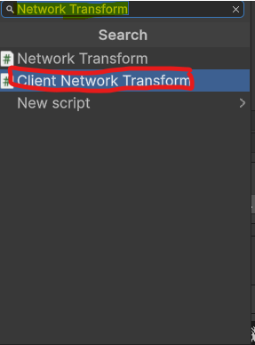

# Sync Transform between clients
[Go back](Network.md)

When you try to build the project. And select the inspector as the Host. And the build as a Client. You will see it wont work! This is because we are not sending the data between players.

Press on the square in the Project Folder and add a the `Client Network Transform` compontent.

Uncheck all the things we are not syncing.

When you play & build. The Transform should be synced!

**Congratulations you finished Sync Transform between clients**
[Next](installation.md)